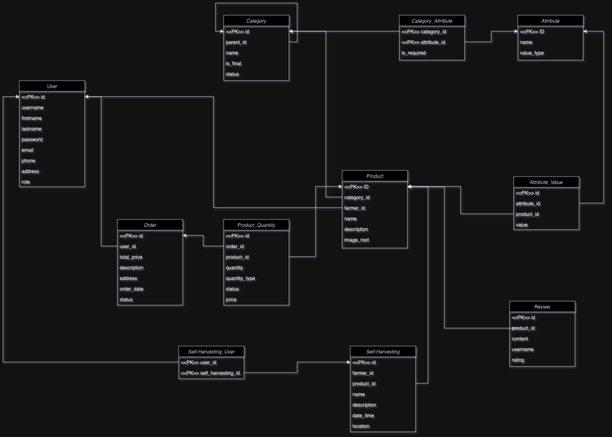

## IIS Project - Vegetables Market Website - Backend
This project is backend for a vegetables market website. This website gives customers the ability to browse, filter, add to cart and order products. Sellers can add their offers, monitor purchases, and manage order statuses. Moderators can adjust product categories and attributes. Admins manage moderators. 

### Features
1. Attributes and Categories

    Categories that contain products can be added by customers. They have a tree structure. Based on them products can be sorted. Attributes show customer different product characteristics. Products can also be filtered with them.

2. Product orders
   
    Products can be ordered by the registered customer. Orders can be monitored and moderated by registered seller.

3. Events
      
   Instead of the usual products, sellers can create events where customers can collect goods themselves. Customers can register for them.
4. Ratings

    Every registered customer can leave a rating with 1 - 5 star and comment for some product.

5. Administration 

    Admin can add and remove moderators. Moderators can edit categories and attributes that products have, can approve new categories proposed by users.
### Database structure 

To understand database design, an ER diagram was made. This diagram shows which tables exist and how they are related to each other.
### Installation
Instruction for project backend installation on the local server.
1. Requirements
Make sure you have the following software installed:
- PHP: Version 8.1 or newer
- Composer: To manage PHP dependencies
- MySQL: Verze 8.0 or newer
- Web server: Apache, Nginx or integrated server Laravel
- Archiving tool: for archive extraction
- Recommendation: Use dev environment like [Laragon](https://laragon.org/)
2. Unpacking the archive
    Download project archive and unpack it to the preferred folder e.g.: `/projects/iis-market-be (Laragon)`
&nbsp;
3. Installing dependencies
    Open a terminal, navigate to the project folder and run:
    `cd cesta/k/iis-market-be`
    `composer install` 

    This will install all the necessary PHP packages.
&nbsp;
4. Configuring the environment
Set environment variables:

   1. Copy environment file:
    cp .env.example .env
   2. Open file .env int a text editor a configure following:
    `DB_CONNECTION=mysql
    DB_HOST=127.0.0.1
    DB_PORT=3306
    DB_DATABASE=database_name
    DB_USERNAME=user
    DB_PASSWORD=password`
        
    3. Generate an application key:
        `php artisan key:generate`
&nbsp;
5. Initialize the database
    Create a new database in MySQL:
    `CREATE DATABASE name_database CHARACTER SET utf8mb4 COLLATE utf8mb4_unicode_ci;`  
    Run the migration and populate the database with data (if included):
    `php artisan migrate --seed`
&nbsp;
6. Start the project
    Start the integrated Laravel server:

    `php artisan serve`
        
    The project will be available at: http://localhost:8000

### Demonstration of functionality
A demonstration of the functionality through the frontend is available at the following link:
[Youtube](https://www.youtube.com/watch?v=a_g-N6VQo98)

### API Documentation
Api documentation with demonstration of using different endpoint and example responses is available at the following link:
[Postman](https://documenter.getpostman.com/view/39788307/2sAYkBsgmr)

